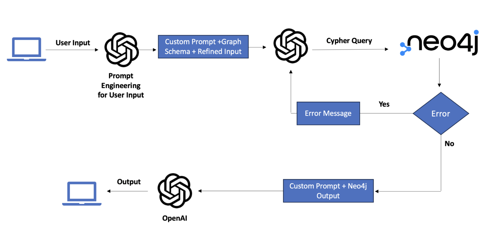

# study_bgp_network.py

The overall process would be the following.

1. Initialisation

A python driver to interact with the Neo4j database is created using the databases’s URI, username and password. Also the OpenAI API key is added as the ‘OPENAPI_API_KEY’ environment variable. 

2. Query is refined

The obtained user input is sent to the completions.create module under the OpenAI client, to be refined. The query is added along with a prompt that specifies how to modify the user input. The response from the `refine_query()` function would contain the refined query.

3. Graph Schema is obtained

In order to obtain the correct query, a description of the node, edges and the relationship type must be passed along with each query. We get the schema of the graph by making a call to the initialized neo4j driver. The description would like the following

TBD

4. Constructing the cypher query

In order to obtain the cypher query, we make a call to gpt-4 using the chat.completion function under the OpenAi client. When we make the call, we have to pass on messages to the chat function, consisting of a system prompt and the user content. We also have an option to add  historical messages but we do not add it during the initial call. The system prompt is given as follows <TBD>. The response message would return the  cypher query generated by the LLM. 

Querying Neo4j

The obtained query is then run on Neo4j using the python driver and the response is obtained. In case the query returned from step c is syntactically incorrect, the driver will return a CypherSyntaxError. We then repeat step c with the error message. The chat.completion module is run again using the user query and response as history, the error message along with the prompt to correct it. The obtained query is then rerun using the driver and the response is collected.

Obtaining the user output

To obtain the final user output, we make a call again to the OpenAI chat.completion module with the response from Neo4j and user query. We provide the user prompt as follows to get a user coherent output. TBD. We check whether the final output contains an apology which is returned if the LLM is not able to deduce the final output. In that case, we prompt the LLM to try again with simplified assumptions. The final output obtained is then returned to the user. 
